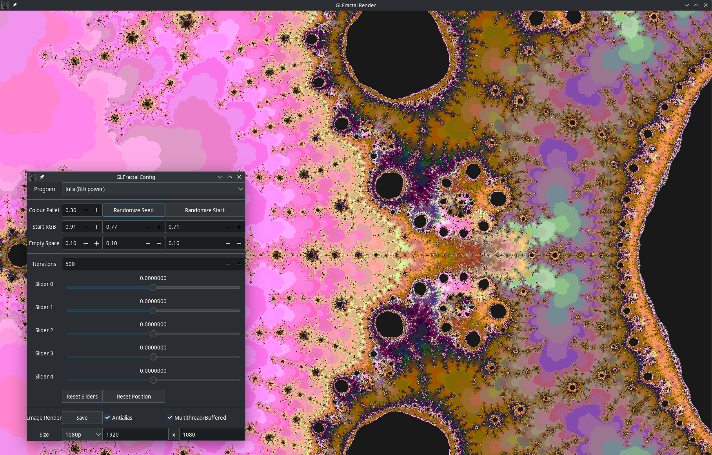

# GLfractal

A fun project for visualising fractals.



Fractals are rendered using OpenGL 4.6 in realtime, with a duplicate native implementation used for saving images.
mandelbrot shader;
```
#version 460

const uint COLOURS = 170;

in vec2 frag;
out vec3 outputColor;

uniform uint max_iterations;
uniform dvec2 pos;
uniform double zoom;
uniform vec3 empty_colour;
uniform vec3[COLOURS] colour_pallet;

dvec2 multiply(in dvec2 i, in dvec2 j) {
    return dvec2(i.x * j.x - i.y * j.y, i.x * j.y + i.y * j.x);
}

void main() {
    dvec2 z = frag * zoom - pos;

    dvec2 z_const = z;
    uint iterations = 0;
    while (abs(z.x) + abs(z.y) <= 4 && iterations < max_iterations) {
        z = multiply(z, z) + z_const;
        iterations++;
    }

    if (iterations == max_iterations) {
        outputColor = empty_colour;
    } else {
        outputColor = colour_pallet[iterations%COLOURS];
    }
}

```

Latest Release: https://github.com/stewi1014/glfractal/releases/latest
